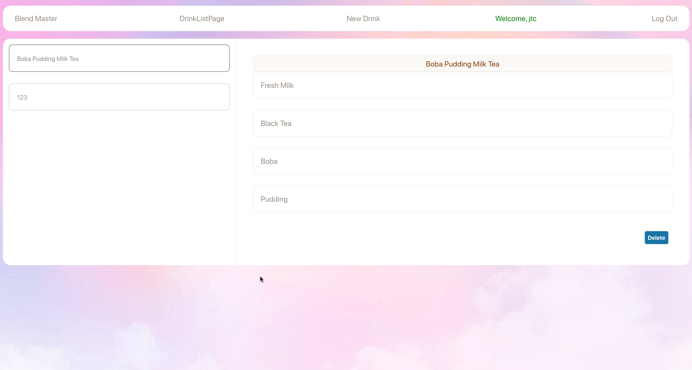

<h1 align="center">Blend Master</h1>

<h2 align="center">

  <a href="https://blend-master-0894513d8d22.herokuapp.com/">🥛 Access the Application 🍵</a>
</h2>

## 🍧 Description

Welcome to Blend Master! This app allows you to create and customize your own drinks. Whether you're a tea enthusiast or a smoothie lover, you can easily create and customize your favorite drinks.

## 🍰 Preview

## 🧃 Technologies Used

## 🍫 Features
- Create and customize your own drinks.
- Add various ingredients like boba, pudding, milk, and more.
- Preview of your own drink.
- Save your customized drinks for future reference.

## 🍪 Upcoming Features
- [ ] Adding some premade drink samples.
- [ ] Adding better animations for preview drink
- [ ] Allow user to login with Google or other accounts
